# Learning Programming Logic With Spark AR

Spark AR studios is a software developed by Facebook for Augmented Reality (AR) creators to easily create AR effects on Instagram and Facebook. However, it can also be used as a great tool for anyone to get familiar with programming logic thanks to its easy to use visual programming tool: Patch Editor! Yes, you can learn the logic of programming without a need to type a single code finally hack into the mind of a programmer! 

This tutorial article is written mainly in the hope that my girlfriend will fear less in learning programming and helping AR creators in general to creator more complex interaction for their AR effects. Since the trend of randomiser effect started, I have seen many creators struggle to make changes to suit their needs from randomiser patch they downloaded from someone else; mainly due to the lack of understanding of how logic works in Patch Editor. It is great that we have available patches which we can download and use it without understanding how it works, but trust me when I say you will be happier if you can understand it and make modification to any patches to customised to your need!

This tutorial is for:

·    Spark AR beginners using Spark AR Studios V99

·    Spark AR beginners who are familiar with Spark AR interface

·    Spark AR beginners with limited knowledge in programming logic

·    Spark AR beginners who finds scripting intimidating

·    Spark AR beginners that wants to become better

·    My girlfriend

Without nagging on too much, I am going to start right away to get your journey started! 

To begin, use download the files from this repository and open the arproject file to follow the tutorial. 

## Hello AR World

If you haven’t known, all programming school and books start their first lesson by teaching how to print “Hello World” on the computer screen. Since AR is much cooler and better, we shall do this AR style!

First, let’s start things easy by connecting the Screen Tap patch to the If Than Else patch. Next, hover your mouse to the simulator, hold down CTRL + Left Mouse Click (Command + Left Mouse Click for Mac) to activate screen tap. 

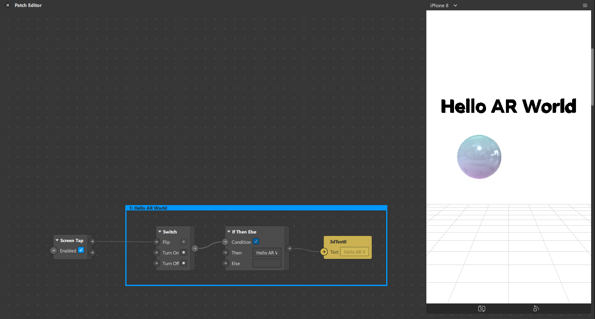

Hooray! You have said taken your first step as a programmer!  

## Data Type

Understanding the different data types in Spark AR is an important foundation all AR creators need to have. The official Spark AR documentation already has a very detailed introduction of data types, it is highly recommended for you to read it! But in case you are lazy, here is a brief inaccurate summary:

**Boolean:** True/False, 1/0, Yes/No

**Scalar:** Basically just numbers in fancy term (Just a joke if you script!)

**Pulse:** An event that happened, like a notification or when you get 1 billion impression in your dream

**Vector 2:** 2 dimensional numbers, e.g X and Y position

**Vector 3:** 3 dimensional numbers, e.g X, Y and Z position 

**Vector 4:** 4 dimensional numbers, usually for texture (Red, Blue, Green, Alpha)

**Color:** It should be colour, the proper way to spell in English

**Progress:** Think of it as number only from 0 – 1, usually used to drive animation or stating my slow progress in writing this tutorial for hackathon

**Matrix 2, 3, 4:** Reloaded, Revolution and more Keanu Reeves

**Texture:** An image you imported (png/jpg) or created in Spark AR, used for material

**Text:** text, some refer it as String too

## If Then Else

If then else, or if else, is one of the simplest yet important concept for all programming languages. Just with If else, you can make endless combination of logic that suits all your needs. 

In our first exercise in Hello AR world, we have already used the If The Else patch that Spark AR has provided us. 

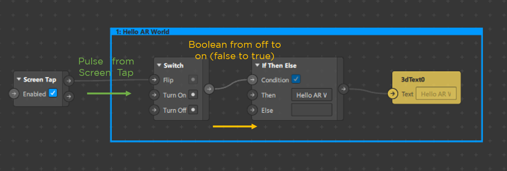

When you did a screen tap, a pulse signal is sent to the Switch patch (off by default), which convert a pulse to Boolean value, by turning Boolean from off to on (false to true). The true Boolean is then passed on to the If then Else patch to make the condition true. In the If then else patch, there are 2 inputs:

1. Then: value to pass to output when condition is true

2. Else: value to pass to output when condition is false

Hence, when a pulse signal of screen tap is sent, it changes the value of the text from blank to “Hello AR World” because the condition is true. Before moving on, try tapping on the screen again to turn the condition from true to false, making the text blank again.  

###### QUIZ TIME

What happens if you connect Screen Tap to “Turn On” input instead?

**<u>Answer</u>**

*A Switch patch is in Off state by default when you add it in the patch editor. In our previous example, we connect screen tap to the “Flip” input of Switch patch, and hence we can flip it like a normal switch by turning it on the 1st tap, and off again on 2nd tap. If you connect screen tap to “Turn On” input instead, you can only turn the switch on your 1st tap. The subsequence tap will result in no changes since you can’t turn a switch on again while it is already turned on. Neither will you turn the switch off since screen tap is only connected to “Turn On”.* 

So what other logic can you do with If then Else patch? Before we proceed, disconnect the screen tap from Switch in 1:Hello AR World and connect it to the Switch patch in 2: If Then Else. Continue each of the steps below by disconnecting and connecting the Screen Tap patch from the current to the next. 

1. **Toggling visibility of objects** 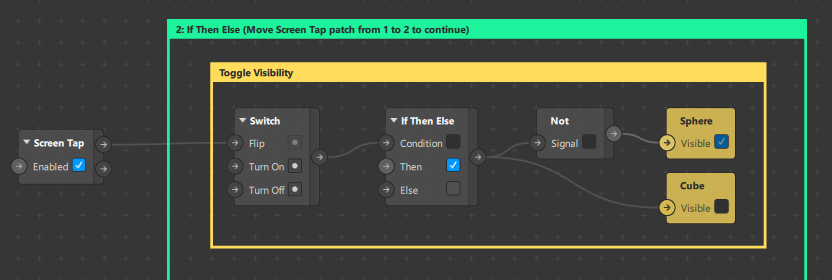

In this case, the two possible output are also Boolean value true and false. When condition is True, it will output True value and vice versa. By adding a Not patch after If Then Else patch, you can reverse the Boolean value, hence the name Not. 

2. **Passing Pulse signal through only when you want it**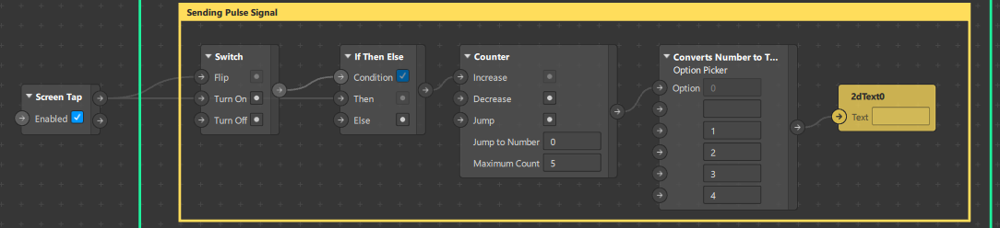

Connect the same Screen Ta patch to get the setup above. If you try tapping on the screen, you will realise that the text only changes at every other tap. This happen because the pulse signal is only passed through when the condition in the If Then Else patch is true. There is no input for Else, so no pulse will ever be created and pass through if the condition is false. 

**Bonus**

We are also using Counter to increase number from 0 -5 and using Option Picker to convert number to text. 

3. **Switching Texture**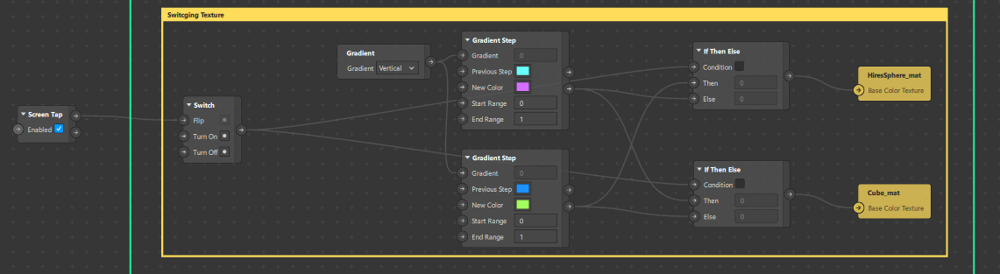

We can connect If Then Else patch with almost all data type, as long as both inputs have the same data type. In this example, we are switching between the 2 gradient textures using the same logic as above. You can see the colour of the sphere changes as you tap on the screen of the simulator.

##### **RECAP**

To summarise, If Then Else patch allows you to setup a condition to switch between two data input. If condition is true, the “Then” input will be passed through, else the other input will be passed through. 

## Logic Patch

Logic patches allows you to create varies condition to activate/deactivate conditions for your If Then Else patch. Again, I highly recommend you to read through the official [Spark AR documentation on Math Patch](https://sparkar.facebook.com/ar-studio/learn/patch-editor/math-patches/). I will briefly go through some of the useful patches which we will be using later on below.

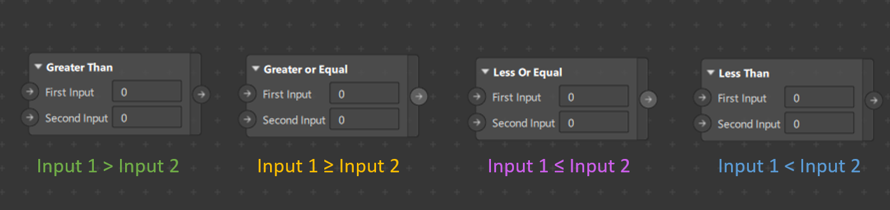

These patches are pretty much self-explanatory, when each of the condition is met, it will output a true Boolean value which you can connect with If Then Else patch to switch between data type. 

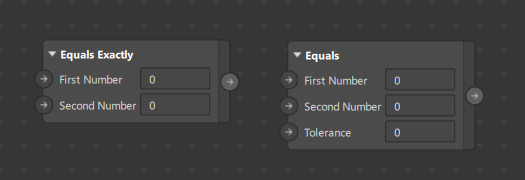

The difference between Equal Exactly and Equals is the Tolerance input. If you set a Tolerance input of 0.5, the output will become true when the first number is within +- 0.5 range of second number. If Tolerance is 0, it will work the same as Equals Exactly patch.

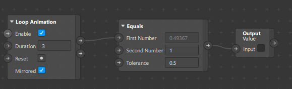

Using the loop animation patch, we can drive value from 0 – 1, then back to 0 again to observe when Equals patch will output true value.

·    And patch: Output true value when both Boolean inputs are true

·    Or patch: Output true value when any one of Boolean input is true

·    Not patch: reverse the Boolean input

## Math Patch

Math patches are also very useful patches that can aid in setting up any logic you need. Below are some of the basic patches that I used the most often daily. 

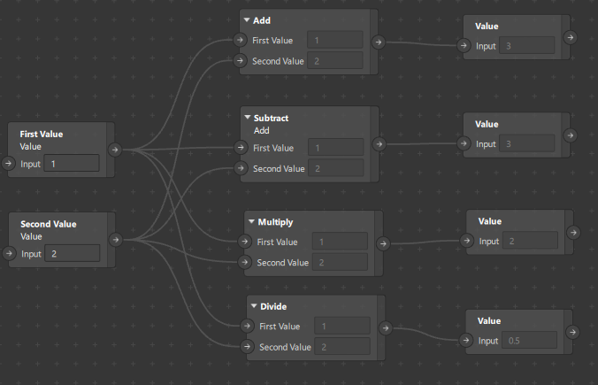

The Add, Subtract, Multiply and Divide patches are rather straight forward and works as it said. You can observe the output values of each value patches to see the differences in case you are still confused. 

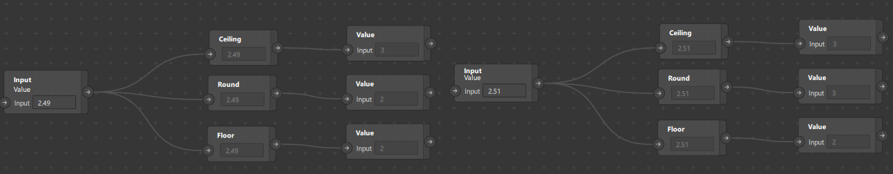

The floor, round and ceiling patches are also straight forward but might not be as intuitive for new programmers. In the screenshot above, we have 2 input values of 2.49 (left) and 2.51(right) respectively. 

·    Ceiling patch: Always round up to the nearest whole number regardless of decimal values

·    Round patch: Round to the nearest (can be up or down) whole number dependent on decimal values

·    Floor patch: Always round down to the nearest whole number regardless of decimal values

Hence, when input is 2.49, the round patch will round down the output to 2. And when input value is 2.51, it will round up the output to 3. 

## Project: Random Generator with result-based animation

Even though the random generator effects have been trending for close to a year and many templates are also available online to use it right away, I realise that most new creators are just using the templates blindly without actually understanding the whole process. This is especially true when new creators tried to add in customized animation or sound effects that changes according to the random generated result. Most of the time, new creators get stuck at this process of customisation due to the lack of experience in programming logic in Spark AR.

In this second part of the tutorial, I am going demonstrate how you can use the patches introduced above to set up result-based animation from a standard random generator patches layout. Beside we proceed, do make the objects in part 1 and 2 invisible by unchecking the visible options in Scene tab. 

Select these 2 objects and uncheck the visible option in the inspector on the right. Next, check and make 3: Random-Generator visible. 

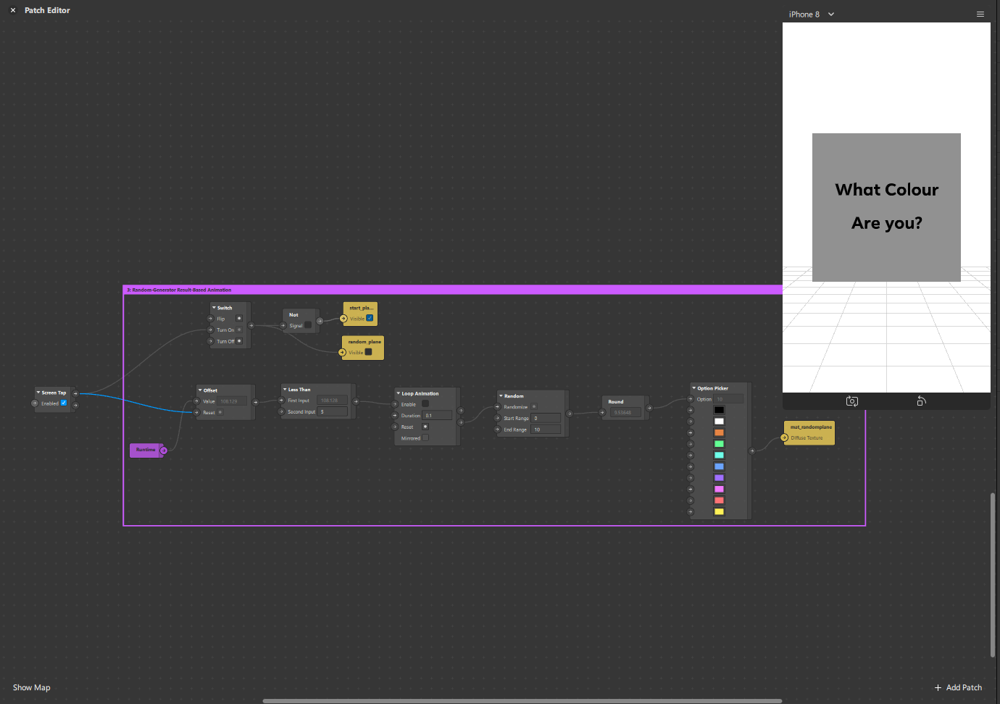

This is a one of the most common setups for random generator which you can found online. In our example, it is a simple “What Colour Are You?” with just 1 plane changing colour randomly for 5 seconds before stopping to a final random colour. So what actually happens in all these patches when you tap the screen?

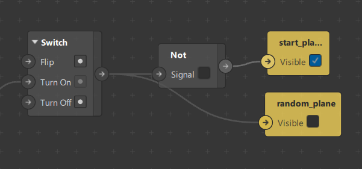

First, we look at the visibility of the Start Plane and Random Plane. By default, we want the start plane, the one that asks the question “What Colour Are You?” to be visible at the start. When the random generation happens, the start plane should disappear and the random plane will appear to show the generation. So here’s where we can make use of the Switch and Not patches. Remember, by default, the Switch patch is always Off (False). Hence, the reverse of false will be true and we can use a Not patch to make Start plane appear (True) by default. Once tapped, the switch will be switched on, turning start plane invisible (False) and random plane visible (True). 

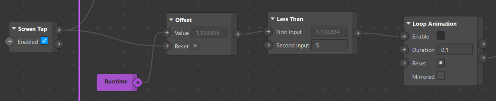

Next, we look at the random generator. The offset patch will reset the runtime every time Screen Tap send a pulse. Using the Less Than patch, we can send a True Boolean to enable Loop Animation patch for 5 seconds. The loop Animation patch will send a pulse every 0.1 second if the Enable input is True, so it will send a total of 50 pulse signals in the 5 seconds when Less Than patch output a true value. 

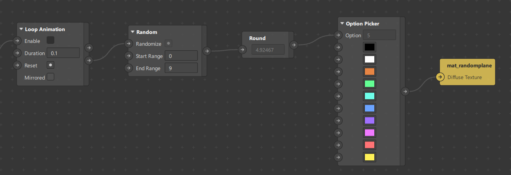

Finally, the Loop Animation patch sends a completed pulse signal to the Random patch every 0.1 seconds when it is enabled. Random patches will generate a random value (with decimals) between the Start and End Range. However, as we are using Option Picker to output all 10 possible colours, we need to round up the random number to a whole number using Round patch. The Option Picker will output the corresponding colours from 0 – 9 (Total 10 as we count from 0) to the Diffuse texture. After 5 seconds, the last rounded generated random number (between 0 – 9) will be the result. 

Ok. By now I hope you have some understanding of how the basic random generator works. How can we add in what we want: Different animation for each different result? (Note: I am trying to avoid the easiest option, using Option Picker patch for practice purpose)

What we know

·    There are 10 possible results, each represented by a number from 0 – 9

·    We have logic patches like Equal Exactly to output True Boolean value when condition is met

Do you get where I am going at already?

To make things simple, we are just going to make simple animation of scaling the plane with scale of 2 as default. 

·    If result = 0, scale from 2 to 1.9

·    If result = 1, scale from 2 to 1.8

·    If result = 2, scale from 2 to 1.7

·    If result = 3, scale from 2 to 1.6

·    If result = 4, scale from 2 to 1.5

·    If result = 5, scale from 2 to 1.4

·    If result = 6, scale from 2 to 1.3

·    If result = 7, scale from 2 to 1.2

·    If result = 8, scale from 2 to 1.1

·    If result = 9, scale from 2 to 1.0

As mentioned, we are going to try achieving this without using Option Picker patch for practice purpose. 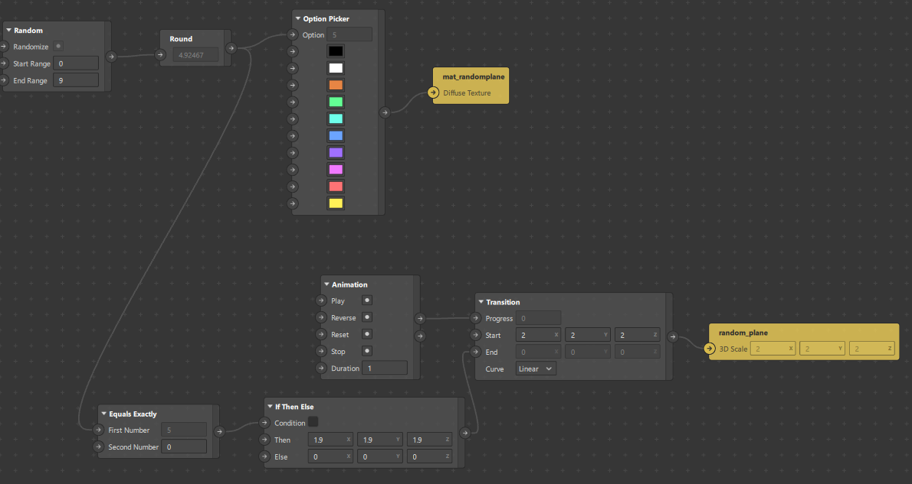

First, we setup what happens when result = 0 using Equal Exactly and If The Else. The Then input is the scale of 1.9, which is the scaling for when result = 0. What we need to do next is just to repeat the whole process, but connect the If Then Else to the Else of previous If The Else patch. 

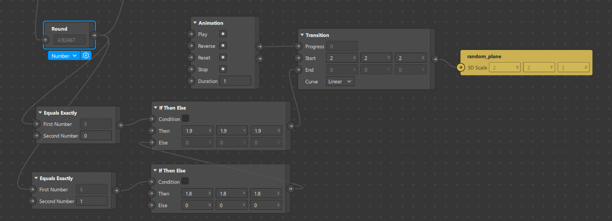

Here we added the equal exactly for when result = 1, and connect it to If Then Else patch with Then input of scale 1.8. All we need to do for the rest is to repeat this process for another 7 times. 

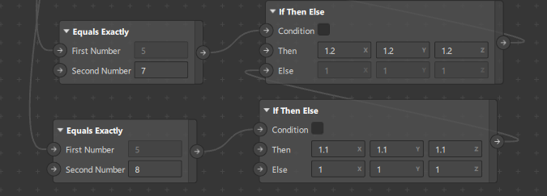

When we reach Equal Exactly = 8, there is no need for us to add another Equal Exact to check for result = 9. That’s because if the result is not equal to all numbers from 0 – 8, it must be 9. Hence, at the last If The Else, we just need to put in the Scaling when result = 9 (which is 1) in the Else input. 

Next, we just need to trigger the animation patch to start playing. The condition to start the animation is:

·    After Screen Tap/Trigger of random generator

·    5 seconds after the start of random generation

What we have:

·    A Less Than patch that become False after 5 seconds

·    Not patch to reverse Boolean value

·    And patch to consider two conditions

Hence, to trigger the animation only at 5 seconds after random generation starts:

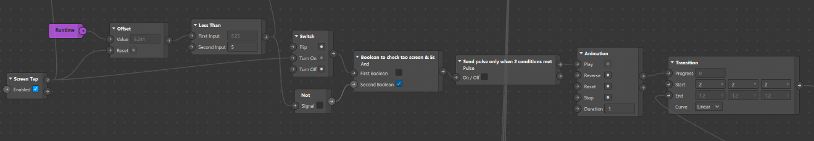

We connect 1) Switch patch to check if screen is tapped and 2) Not patch to check if 5 seconds has passed after start of randomizing. Only when both conditions are met, the And patch will output a True Boolean to pulse patch (convert Boolean to pulse), which will send a pulse to start playing the animation. 

# What else can you do with this?

Just by using Equal Exactly and If Then Else, you can

·    Trigger different audio clips for each random result

·    Make different animation sequences for each random result appear and play

·    Assign different textures for other objects based on each random result

·    Trigger different particles’ birthrate for each random result

·    Many many more!

If you have made it this far and still understand what I have wrote, thank you and well done!! (especially if you are my girlfriend). If you have find this article helpful, do let me know so I know that I can continue to write a second part of this tutorial! 

Lastly, to end off this tutorial article, the only way you can stop progressing is when you give up. As long as you put in any effort to create any AR effect with Spark AR, you are making progress! I have made it this far with this same belief so you can do it too!

To find out more about me and AR effect I have created, follow @gowaaaofficial on Instagram!